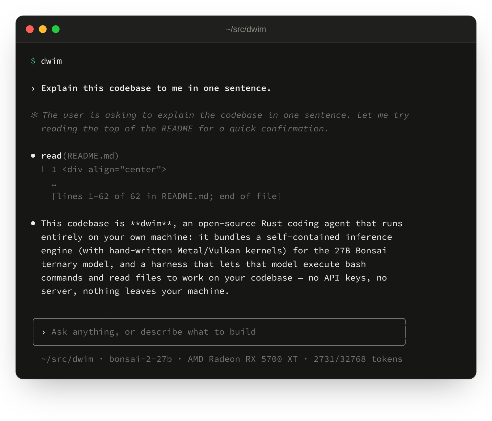

<div align="center">
  

# dwim

**A coding agent that runs on your own GPU.**

The agent, the model, and the engine that runs it, in one Rust program:
no API key, no server, and nothing leaves your machine.

[](https://huggingface.co/prism-ml/Ternary-Bonsai-2-27B-gguf)
[](LICENSE.md)

</div>

> [!WARNING]
> **dwim is experimental software.** Expect bugs, rough edges, and changes that
> break things from one commit to the next. The model runs shell commands on
> your machine without asking first, so use it on code you have committed or
> backed up.

## Installation

To install the latest release:

```console
curl -fsSL https://dwim.sh/install.sh | sh
```

To install the latest development version:

```console
cargo install --git https://github.com/dwim-sh/dwim
```

Either way, the model (about 6 GB) is downloaded on first use.

## Features

- **A real coding agent.** A shell where the model runs commands, reads their
  output, and keeps going until the task is done. It follows your project's
  `AGENTS.md`.
- **A 27B model in 6 GB.** Bonsai 2 27B, PrismML's ternary version of
  Qwen3.8-27B: every weight is -1, 0, or 1, so it fits on a laptop GPU.
- **Its own inference engine.** No llama.cpp. Metal on macOS, Vulkan
  everywhere else, and a CPU reference the GPU kernels are tested against.
- **No sandboxing.** `dwim` assumes it is already running in a sandbox, such
  as a container or a VM, and does no sandboxing of its own: the model runs
  the commands it wants, without asking.

## Getting started

Run `dwim` in a project directory. It opens a shell: type what you want, and
the model reads files, runs commands, and answers.

<div align="center">
  
</div>

To ask one thing and exit, give the prompt on the command line:

```console
dwim "Explain this codebase to me in one sentence."
```

The manual page has the options, the shell's commands and keys, and the files
it reads:

```console
man dwim
```

## License

[MIT](LICENSE.md).
